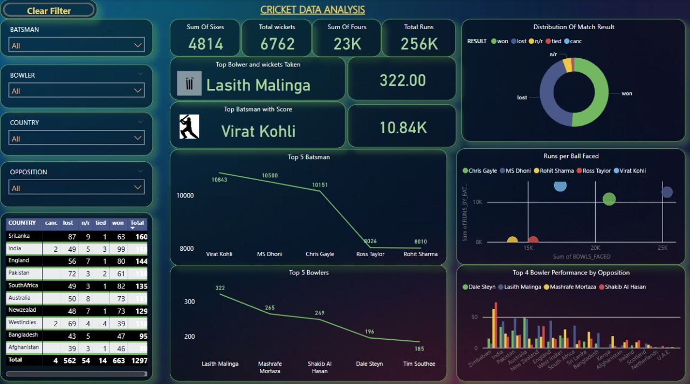

# 🏏 Cricket Data Analytics Dashboard

An end-to-end data analytics project that visualizes and analyzes ODI cricket match data (2013–2019) using **SQL (Snowflake)** for data cleaning and **Power BI** for dashboard creation. The dashboard uncovers actionable insights on batsmen, bowlers, and match outcomes across teams and matches.

---

## 📌 Problem Statement

> Analyze ODI match data from 2013 to mid-2019 to uncover meaningful insights and create a visually engaging dashboard.

---

## 📂 Dataset Description

The dataset consists of three main tables:

### 1. `BATSMAN_DATA`
- `BATSMAN`, `PLAYER_ID`, `MATCH_ID`, `START_DATE`, `GROUND`, `OPPOSITION`
- Performance metrics: `RUNS`, `BALLS_FACED`, `FOURS`, `SIXES`, `SR`

### 2. `BOWLER_DATA`
- `BOWLER`, `MATCH_ID`, `OPPOSITION`, `GROUND`, `START_DATE`
- Metrics: `WICKETS`, `ECONOMY`, `MAIDEN_BALLS`, `AVG_SPEED`

### 3. `ODI_MATCH_RESULTS`
- `MATCH_ID`, `RESULT`, `MARGIN`, `TOSS`, `COUNTRY`, `OPPOSITION`, `START_DATE`, `GROUND`

---

## 🧹 Data Cleaning Process

Cleaning was performed using **SQL in Snowflake**:

- Replaced hyphens and special characters with `0` or cleaned using `REGEXP_REPLACE`.
- Fixed invalid date formats using date functions.
- Removed irrelevant columns like `Irrelevant`, `BR`, etc.
- Unified inconsistent text entries (e.g., “v” in Opposition).
- Replaced blank results with `"Draw"` or `"Cancelled"` as per context.
- Created master tables for integrated visualization.

---

## 📊 Dashboard Features

Created using **Power BI** with clean and connected datasets:

- **Top 5 Batsmen** by total runs (e.g., Rohit Sharma, Virat Kohli).
- **Top 5 Bowlers** by total wickets (e.g., Lasith Malinga, Tim Southee).
- **Match Results** breakdown (Win, Loss, Draw).
- **Run vs Ball Faced** chart for batsmen.
- **Bowler performance by opposition.**
- **Interactive filters**: Country, Batsman, Bowler, Opposition.

---

## 📷 Dashboard Preview

---

## 🔍 Key Insights

- 🇱🇰 **Sri Lanka** played the most matches.
- 🇿🇦 **South Africa** had the most wins.
- 🎯 **Lasith Malinga** took the most wickets.
- 🏏 **Virat Kohli** had the highest overall score.
- ⚡ **Rohit Sharma** consistently performed with high strike rates.

---

## 🛠 Tools & Technologies

- **SQL (Snowflake)** – Data cleaning & preparation
- **Power BI** – Data visualization & dashboarding
- **MS PowerPoint/Word** – Documentation and workflow

---

## 🧠 Author

**Suraj Pradhan
